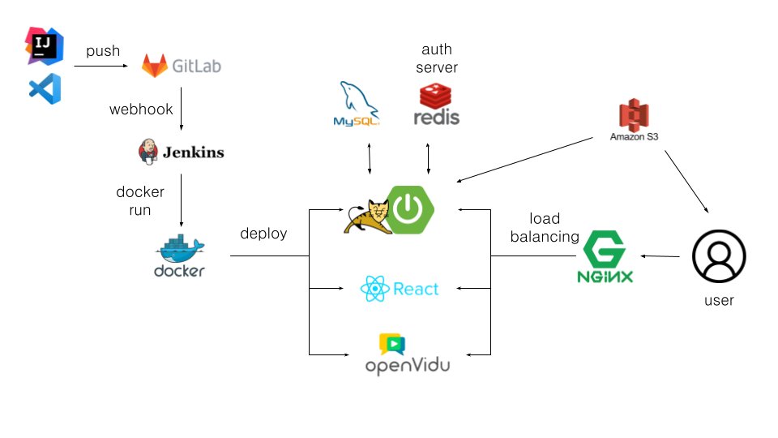
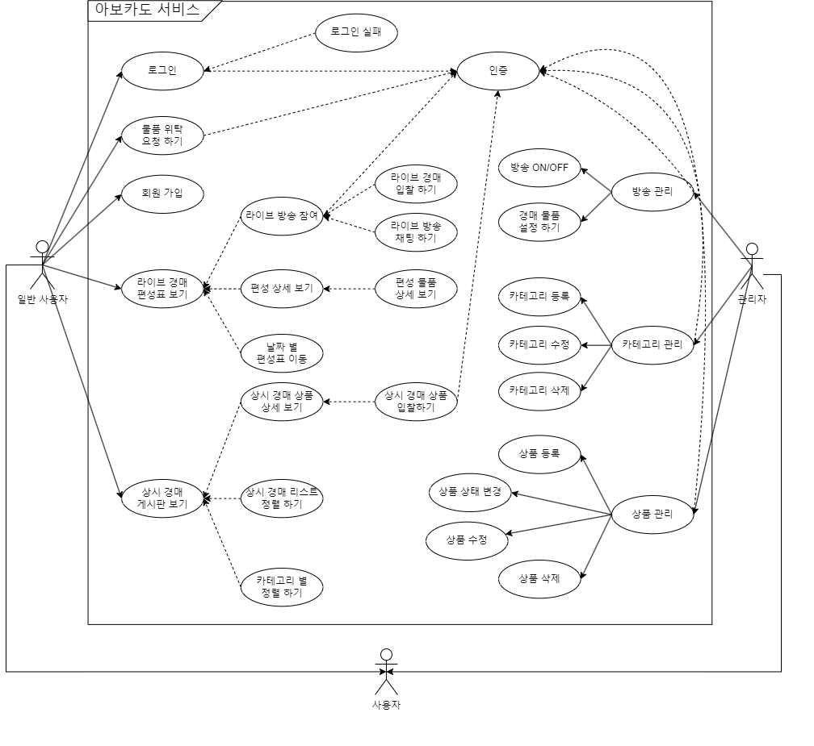
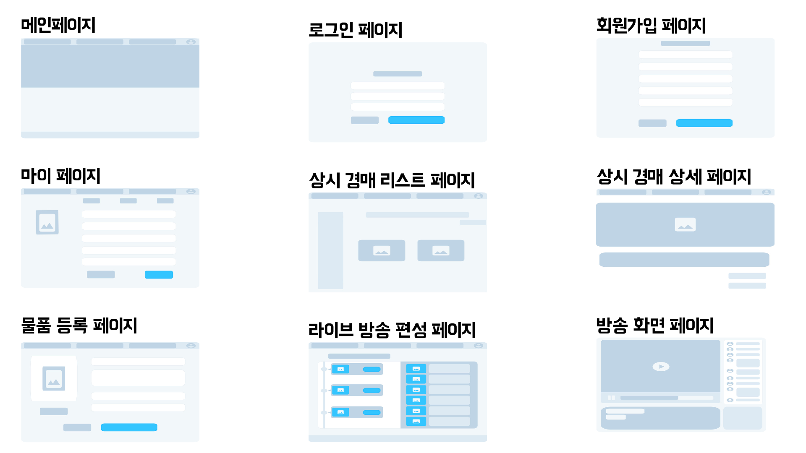

# 🥑 아보카도 마켓 - cicd

<h4 align="center">아보카도 라이브 경매 프로젝트</h4>

<h5 align="center">개발기간: 2023.07.10 ~ 2022.08.18</h5>

팀 명 : A4용지

프로젝트 명 : AVOCADO

팀원 : 황시은, 정연수, 오승기, 이원희, 정재현, 권민재

배포 링크 : [아보카도 경매](https://i9a407.p.ssafy.io)

<strong>아</strong>무거나

<strong>보</strong>여주고

<strong>카</strong>메라로 판매하는

<strong>도</strong>떼기경매

# ❤ 서비스 소개

`경매` 거래방식을 메인으로 잡은 서비스로, 이용자의 물건을 등록하고 `라이브경매`와 `상시경매`를 통해 이용자는 다양한 상품을 적절한 가격으로 구매할 수 있습니다.

# 🧡 팀원 소개

|                  황시은                   |                       정연수                        |               오승기                |                    이원희                    |   정재현   |        권민재         |
| :---------------------------------------: | :-------------------------------------------------: | :---------------------------------: | :------------------------------------------: | :--------: | :-------------------: |
| 
확실히 이해하면서
 
진행하자!
 | 
모르는 건 익히고,
 
할 수 있는 건 최선!
 | 
마인드도 실력도
 
성장!
 | 
항상 긍정적으로
 
최선을 다하자!
 | 미리 하기! | “그냥” 이라 하지 않기 |

 

# 💛 기술 스택

### Backend

 
  
  
  

### Database

  
  

### Frontend

  
  

### CI/CD & infra

  
  
  
  

# 💚 	컨벤션 & Git flow

## 1. 브랜치 관리
Git-Flow 브랜치 전략에 따라 기능별로 브랜치를 나누어 작업하고 있고 모든 브랜치에 대해 pull request를 통한 리뷰 완료 후 Merge를 하고 있습니다.

✅ master : 제품으로 출시될 수 있는 브랜치

✅ develop : 다음 출시 버전을 개발하는 브랜치. feature에서 리뷰완료한 브랜치를 Merge

✅ feature : 기능을 개발하는 브랜치

✅ hotfix : 출시 버전에서 발생한 버그를 수정하는 브랜치

참고 문헌
- [우아한 형제들 기술블로그 "우린 Git-flow를 사용하고 있어요"](https://woowabros.github.io/experience/2017/10/30/baemin-mobile-git-branch-strategy.html)
- [README 참고](https://github.com/f-lab-edu/event-recommender-festa)

## 2. 커밋 관리

Karma - Git Commit Msg

[http://karma-runner.github.io/0.10/dev/git-commit-msg.html]

# 💜 프로젝트 중점사항

- 문서화를 통한 협업
- PR 과정에서 발생하는 conflict 해결 및 협업 능력 향상
- Spring Boot를 활용해 주어진 요구에 맞춰 REST API 설계 및 구현
- 주어진 요구에 맞춰 ERD 설계

# 💛 프로젝트 구조

# 🤎 유스케이스 다이어그램

# 🖤 DB ERD

# 🤍 Front

### 와이어프레임

### 목업

